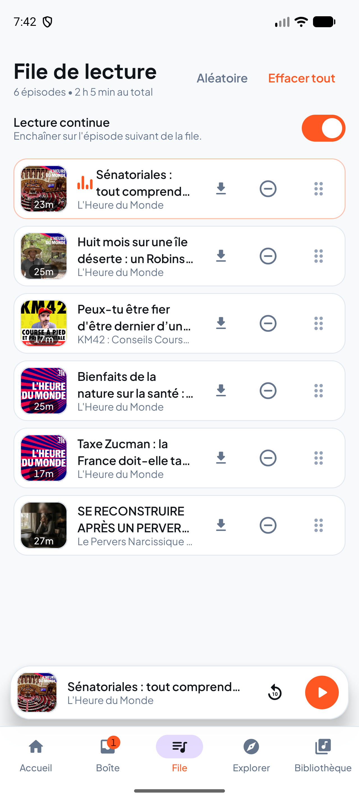
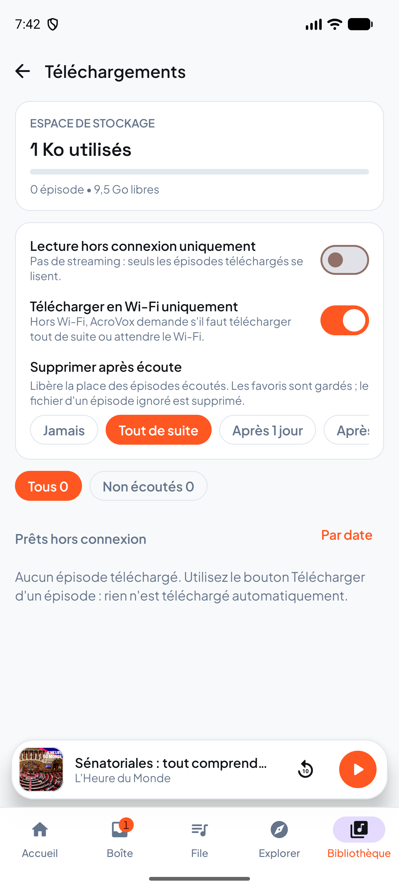
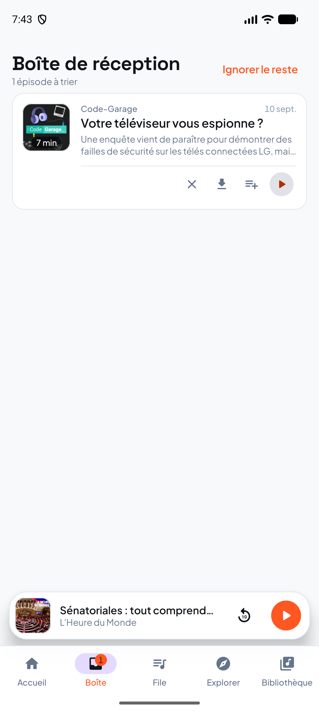

# AcroVox

Android podcast player, inspired by AntennaPod. Built with AI assistance.

> Install and update via Obtainium: see [OBTAINIUM.md](OBTAINIUM.md).

## Screenshots

| | | |
|---|---|---|
|  |  |  |
|  |  |  |

## Prerequisites

- JDK 17 or later (`brew install openjdk@17`).
- Android SDK with platform 37.
- `local.properties` with `sdk.dir=...` (not versioned).

## Build

```bash
export JAVA_HOME=/opt/homebrew/opt/openjdk@17/libexec/openjdk.jdk/Contents/Home
./gradlew assembleDebug
```
